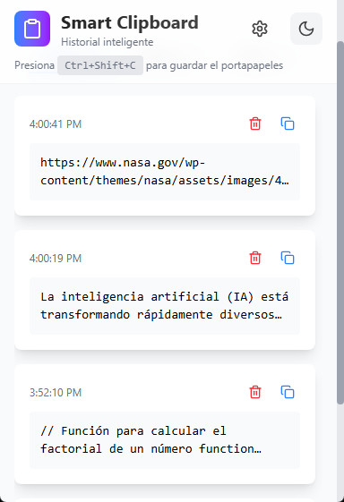
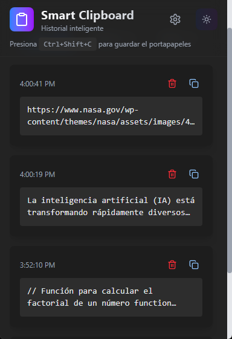
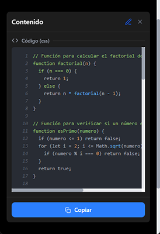
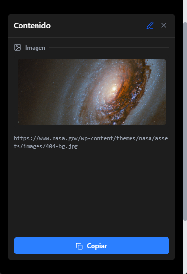
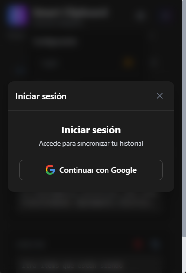
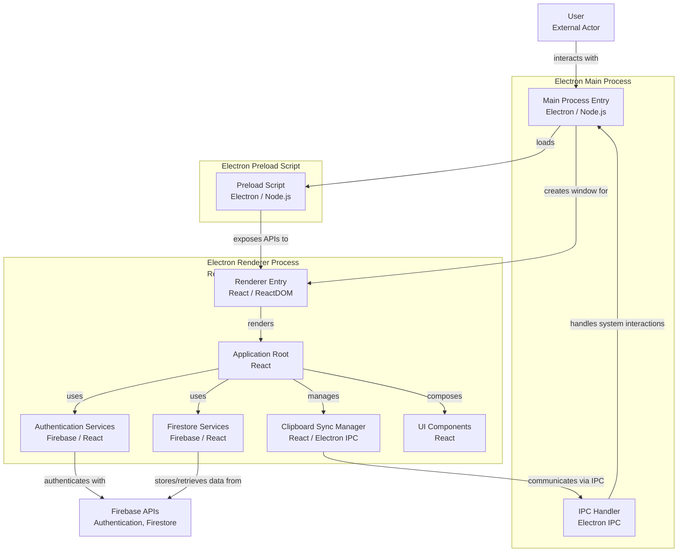

# Smart Clipboard - Historial Inteligente

Una aplicación de escritorio desarrollada con Electron que proporciona un historial inteligente del portapapeles con sincronización en la nube y organización por pestañas.

## 📸 Capturas de Pantalla

<table>
  <tr>
    <td align="center">
      
      <br><b>Modo Claro</b>
    </td>
    <td align="center">
      
      <br><b>Modo Oscuro</b>
    </td>
  </tr>
  <tr>
    <td align="center">
      
      <br><b>Vista Previa de Código</b>
    </td>
    <td align="center">
      
      <br><b>Vista Previa de Imágenes</b>
    </td>
  </tr>
  <tr>
    <td align="center" colspan="2">
      
      <br><b>Pantalla de Login</b>
    </td>
  </tr>
</table>

## 🚀 Características

- **Organización por Pestañas**: Separa enlaces de otros tipos de contenido
- **Sincronización en la Nube**: Respaldo y sincronización mediante Firebase
- **Atajo Global**: `Ctrl+Shift+C` para guardar contenido del portapapeles
- **Vista Previa de Enlaces**: Muestra previsualizaciones automáticas de URLs
- **Renderizado Inteligente**: Soporte para código, markdown y texto plano
- **Modo Oscuro**: Interfaz adaptable con tema claro/oscuro
- **Autenticación**: Sistema de cuentas para sincronización personal

## 🏗️ Arquitectura

La aplicación sigue una arquitectura de tres capas basada en Electron:



### Componentes Principales

#### Proceso Principal (Main Process)
- **Main Process Entry**: Punto de entrada de la aplicación Electron
- **IPC Handler**: Maneja la comunicación entre procesos e interacciones del sistema

#### Proceso de Renderizado (Renderer Process)
- **Application Root**: Componente raíz de React que orquesta toda la aplicación
- **Authentication Services**: Servicios de autenticación con Firebase
- **Firestore Services**: Servicios de base de datos para almacenamiento en la nube
- **Clipboard Sync Manager**: Gestor de sincronización del portapapeles via IPC
- **UI Components**: Componentes de interfaz de usuario (Header, Tabs, Cards, etc.)

#### Script de Precarga (Preload Script)
- **Preload Script**: Expone APIs seguras del proceso principal al renderizador

## 🛠️ Stack Tecnológico

### Frontend
- **React 19** - Framework de interfaz de usuario
- **TypeScript** - Tipado estático
- **Tailwind CSS 4** - Framework de estilos
- **Framer Motion** - Animaciones
- **Lucide React** - Iconografía

### Backend/Desktop
- **Electron 37** - Framework de aplicaciones de escritorio
- **Node.js** - Runtime de JavaScript

### Servicios en la Nube
- **Firebase Authentication** - Autenticación de usuarios
- **Firestore** - Base de datos NoSQL

### Herramientas de Desarrollo
- **Vite** - Bundler y servidor de desarrollo
- **Electron Forge** - Herramientas de construcción y empaquetado
- **ESLint** - Linter de código
- **PostCSS** - Procesador de CSS

## 📦 Instalación

### Prerrequisitos
- Node.js 18 o superior
- npm o pnpm

### Pasos de Instalación

1. **Clonar el repositorio**
```bash
git clone https://github.com/A-Hallen/smart-clipboard
cd gemini
```

2. **Instalar dependencias**
```bash
npm install
# o
pnpm install
```

3. **Configurar Firebase**
   - Crear un proyecto en Firebase Console
   - Configurar Authentication y Firestore
   - Crear archivo `.env` con las credenciales:
```env
VITE_GOOGLE_CLIENT_ID = your_google_client_id
VITE_GOOGLE_CLIENT_SECRET = your_google_client_secret
VITE_API_KEY = your_api_key
VITE_AUTH_DOMAIN = your_auth_domain
VITE_PROJECT_ID = your_project_id
VITE_STORAGE_BUCKET = your_storage_bucket
VITE_MESSAGING_SENDER_ID = your_messaging_sender_id
VITE_APP_ID = your_app_id
VITE_MEASSUREMENT_ID = your_measurement_id
```

4. **Ejecutar en modo desarrollo**
```bash
npm start
# o
pnpm start
```

## 🚀 Scripts Disponibles

- `npm start` - Inicia la aplicación en modo desarrollo
- `npm run package` - Empaqueta la aplicación para distribución
- `npm run make` - Crea instaladores para la plataforma actual
- `npm run publish` - Publica la aplicación
- `npm run lint` - Ejecuta el linter de código

## 📁 Estructura del Proyecto

```
src/
├── components/          # Componentes reutilizables
├── context/            # Contextos de React
├── hooks/              # Hooks personalizados
├── services/           # Servicios (Firebase, etc.)
├── types/              # Definiciones de tipos TypeScript
├── utils/              # Utilidades y helpers
├── assets/             # Recursos estáticos
├── App.tsx             # Componente principal
├── Header.tsx          # Componente de cabecera
├── main.ts             # Proceso principal de Electron
├── preload.ts          # Script de precarga
└── renderer.tsx        # Punto de entrada del renderizador
```

## 🎯 Uso

1. **Guardar Contenido**: Usa `Ctrl+Shift+C` para guardar manualmente el contenido actual del portapapeles
2. **Navegación**: Usa las pestañas para alternar entre "Enlaces" y "Otros" contenidos
3. **Sincronización**: Inicia sesión para sincronizar tu historial

## 🔧 Configuración

### Configuración de Firebase
La aplicación requiere configuración de Firebase para:
- Autenticación de usuarios
- Almacenamiento de datos en Firestore

## 📄 Licencia

Este proyecto está bajo la Licencia MIT. Ver el archivo `LICENSE` para más detalles.

## 🐛 Reportar Problemas

Si encuentras algún problema o tienes sugerencias, por favor abre un issue en el repositorio.
