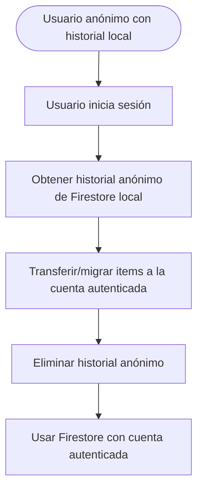

# Migración de Datos: Usuario Anónimo → Usuario Autenticado

## Objetivo
Garantizar que los datos creados por usuarios anónimos se transfieran de forma segura y transparente a la cuenta autenticada cuando el usuario inicia sesión.

---

## Diagrama de Flujo



---

## Estrategia de Migración
1. **Detectar transición:**
   - Escuchar el evento de login/auth de Firebase Auth.
   - Si el usuario era anónimo y ahora tiene UID autenticado, iniciar migración.
2. **Leer datos anónimos:**
   - Leer todos los items de la colección anónima `/clipboard/{anonUid}/items` (Firestore local).
3. **Transferir datos:**
   - Escribir cada item bajo `/clipboard/{authUid}/items`.
   - Evitar duplicados (por ID o timestamp).
4. **Limpiar datos anónimos:**
   - Borrar los items de la colección anónima.
5. **Actualizar listeners:**
   - Cambiar la suscripción de Firestore al nuevo UID.

---

## Consideraciones Técnicas
- **Persistencia offline:** La migración debe funcionar offline y sincronizarse cuando haya conexión.
- **Conflictos:** Si existen datos en la cuenta autenticada, se pueden fusionar o preguntar al usuario.
- **Atomicidad:** Usar batch writes para eficiencia y consistencia.
- **Feedback al usuario:** Mostrar estado de migración (spinner, mensaje, etc).

---

## Código Sugerido (pseudocódigo)

```typescript
if (wasAnonymous && nowAuthenticated) {
  const anonItems = await getAnonClipboardItems(anonUid);
  await batchWriteToAuthUser(authUid, anonItems);
  await deleteAnonClipboardItems(anonUid);
  subscribeToClipboard(authUid);
}
```

---

## Futuras Mejoras
- Permitir migración selectiva (el usuario elige qué items migrar)
- Manejo avanzado de conflictos (merge manual, etc)
