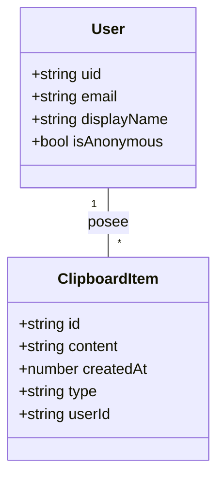
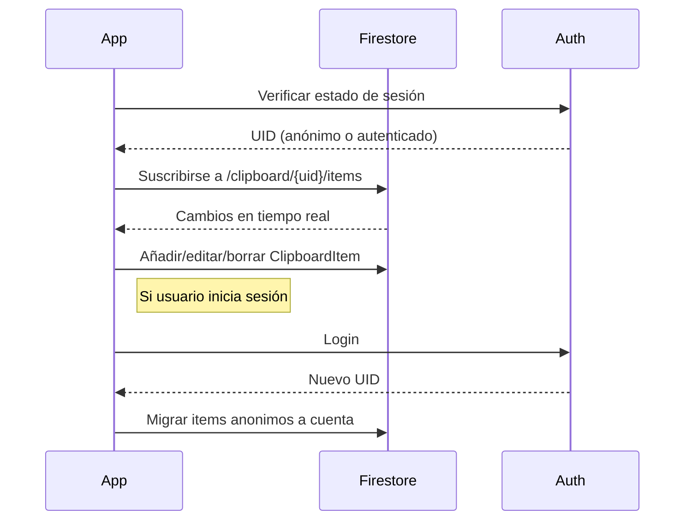

# Arquitectura de Persistencia y Autenticación con Firebase

## Objetivo
Proveer una experiencia de portapapeles inteligente que funcione offline y online, con sincronización en tiempo real y soporte para usuarios anónimos y autenticados, usando Firebase (Firestore + Auth).

---

## 1. Flujo de Usuario

```mermaid
flowchart TD
    Start([Inicio App])
    CheckAuth{¿Usuario autenticado?}
    Anonymous[Usar Firestore en modo anónimo]
    Login[Formulario de login (Google, Email, etc)]
    AuthUser[Firestore con usuario autenticado]
    UseApp[Usar app: leer/escribir historial]
    Upgrade{¿Usuario inicia sesión?}
    Migrate[Migrar datos anonimos → cuenta]
    End([Fin])

    Start --> CheckAuth
    CheckAuth -- Sí --> AuthUser
    CheckAuth -- No --> Anonymous
    Anonymous --> UseApp
    AuthUser --> UseApp
    UseApp --> Upgrade
    Upgrade -- Sí --> Migrate --> AuthUser
    Upgrade -- No --> End
```

- **Usuarios anónimos**: pueden usar la app, historial local y sincronizado con Firestore anónimo.
- **Usuarios autenticados**: historial vinculado a su cuenta, sincronización multi-dispositivo, backup cloud.
- **Transición**: Si un usuario anónimo se autentifica, sus datos locales/anónimos se migran a su cuenta.

---

## 2. Arquitectura de Datos



- Cada usuario (anónimo o autenticado) tiene su colección de ClipboardItems en Firestore.
- Para usuarios anónimos, `userId` será el UID anónimo de Firebase Auth.

---

## 3. Ciclo de Vida de Datos



---

## 4. Persistencia Offline
- Firestore Web habilita persistencia offline por defecto (IndexedDB).
- Cambios locales se sincronizan cuando hay conexión.
- Si el usuario cambia de anónimo a autenticado, se migran los datos locales.

---

## 5. Autenticación
- Por defecto, todos los usuarios usan Auth anónimo.
- Login opcional (Google, Email, etc).
- Si el usuario se autentifica, se migra el historial.
- El usuario puede cerrar sesión y volver a modo anónimo (opcional).

---

## 6. Ventajas de la Arquitectura
- Experiencia fluida offline/online.
- Sincronización en tiempo real.
- Multi-dispositivo para usuarios autenticados.
- Seguridad y aislamiento de datos por usuario.
- Migración transparente de datos anónimos a cuenta.

---

## 7. Directorios y Archivos Clave
- `/src/firebase-config.ts` — Inicialización de Firebase
- `/src/services/auth.ts` — Lógica de autenticación y migración
- `/src/services/firestore.ts` — Acceso y listeners a Firestore
- `/src/hooks/useClipboardSync.ts` — Hook React para sincronizar historial
- `/docs/` — Documentación y diagramas

---

## 8. Futuras Extensiones
- Soporte para compartir items entre usuarios
- Notificaciones push
- Sincronización selectiva
- Backup/exportación manual
