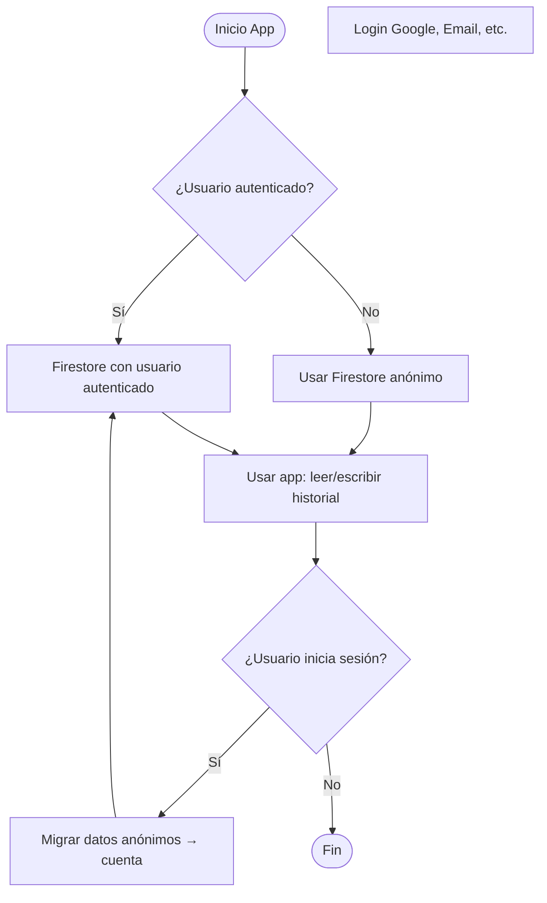
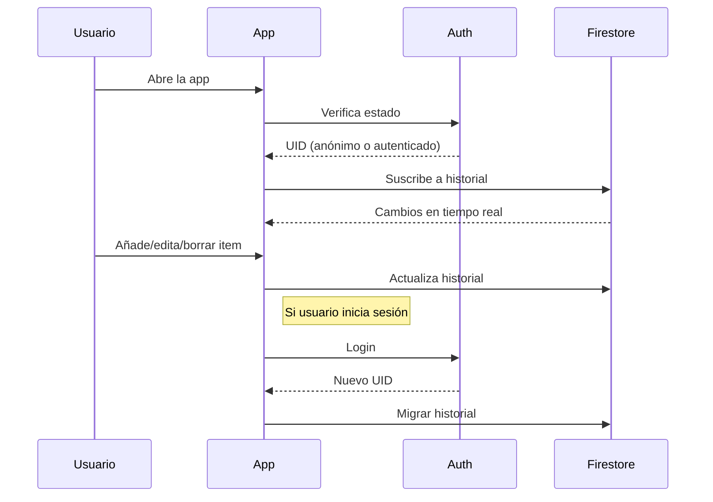

# Flujo de Usuario: Gemini + Firebase

## Resumen Visual

---

## Casos de Uso

### 1. Usuario anónimo
- Puede usar la app inmediatamente.
- El historial se guarda en Firestore bajo un UID anónimo.
- El historial se sincroniza offline/online.

### 2. Usuario autenticado
- Puede iniciar sesión con Google, Email, etc.
- El historial se asocia a su cuenta, accesible desde cualquier dispositivo.
- Ventajas: backup cloud, multi-dispositivo, migración de datos.

### 3. Migración de datos
- Si un usuario anónimo inicia sesión, los datos locales/anónimos se migran a su cuenta.
- No se pierden datos.

### 4. Offline/Online
- La app funciona sin conexión (Firestore offline persistence).
- Los cambios se sincronizan al recuperar la conexión.

---

## Estados de la App

| Estado                | Descripción                                                  |
|-----------------------|-------------------------------------------------------------|
| Cargando              | Verificando estado de auth, inicializando Firestore          |
| Anónimo               | Usuario usando Firestore anónimo, historial local/cloud      |
| Autenticado           | Usuario autenticado, historial sincronizado multi-dispositivo|
| Migrando              | Migrando historial anónimo a la cuenta del usuario           |
| Offline               | Sin conexión, usando datos locales                           |

---

## Diagrama de Secuencia Simplificado

